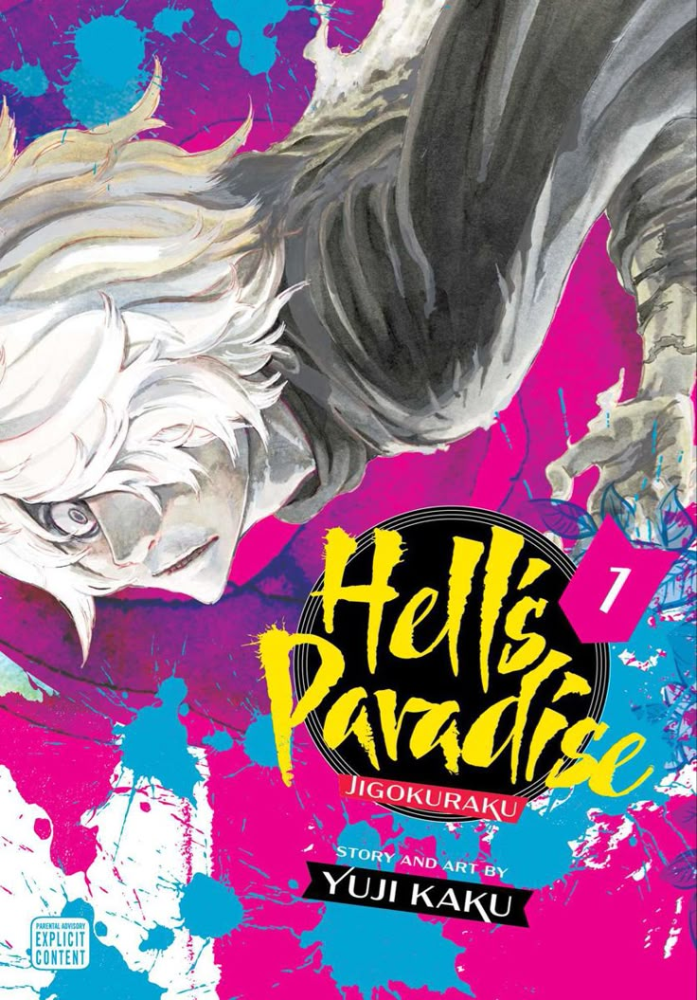

# app-dev
My first repository

# My Favorite Anime Series

**Title:** Hell’s Paradise

**Creator:** Yuji Kaku

**Genre:** Action, Dark Fantasy, Supernatural, Shonen

**Hell’s Paradise** (*Jigokuraku*) is a gripping Japanese anime and manga series created by **Yuji Kaku**. It follows a brutal and mysterious journey involving death row convicts and elite executioners sent to a strange island in search of the **Elixir of Immortality**.

The main character, **Gabimaru the Hollow**, is a deadly ninja sentenced to death. Despite his emotionless reputation, he harbors a deep desire to return to his wife and live a peaceful life. He is offered a chance at pardon if he can survive the island and retrieve the elixir.

Teamed with **Sagiri**, a skilled executioner from the Yamada Asaemon clan, Gabimaru battles monstrous creatures, rival convicts, and the island’s eerie guardians. The story dives deep into themes of redemption, humanity, and the will to live.

